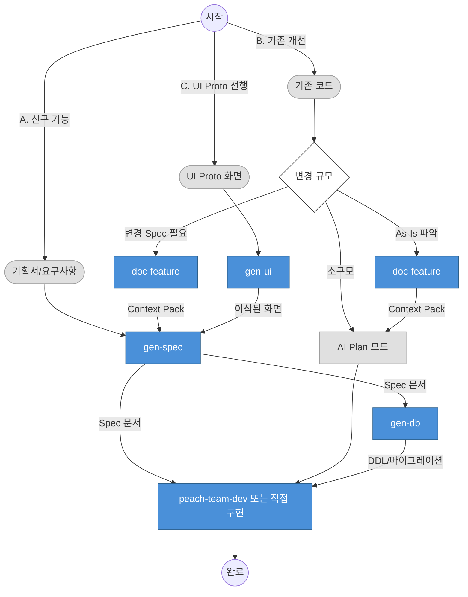

# SDD(Spec-Driven Development) 가이드

피치 하네스에서 SDD 원칙을 적용하는 방법을 안내합니다.

## 빠른 시작: 3가지 시나리오



| 시나리오 | 요약 |
|---------|------|
| **A. 신규 기능** | 기획서/요구사항부터 시작, Spec을 먼저 작성하고 전체 스택 생성 |
| **B. 기존 개선** | 소규모는 Plan 모드로 진행하고, 맥락 보존이 필요하면 doc-feature로 As-Is Context Pack을 만든다. 변경 범위가 크면 Context Pack 기반으로 Spec을 확정 |
| **C. UI Proto 선행** | Proto 화면을 실제 프로젝트에 이식 후, Backend/DB/Store를 구축하고 화면과 연계 |

---

## 1. SDD란 무엇인가

**한 줄 정의:** 구현 전에 명세(Spec)를 작성하고, 이를 AI 에이전트의 컨텍스트로 주입하여 일관된 코드를 생성하는 개발 방법론.

### 기존 개발 방식 vs SDD

| 구분 | 기존 방식 | SDD |
|------|----------|-----|
| 흐름 | 요구사항 → 바로 코딩 → 나중에 문서화 | 요구사항 → Spec 작성 → AI 코드 생성 |
| 문서 시점 | 구현 후 (또는 생략) | 구현 전 (필수) |
| AI 활용 | 코드 보조 (바이브코딩) | 명세 기반 생성 (컨텍스트 주입) |
| 재현성 | 낮음 (세션 의존적) | 높음 (Spec이 보존됨) |

### SDD 성숙도 3단계

1. **Spec-first** — 명세를 먼저 작성한다. 구현 전에 "무엇을 만들지"를 확정.
2. **Spec-anchored** — 명세가 구현의 닻(anchor) 역할을 한다. AI가 Spec을 참조하여 코드를 생성하고, QA도 Spec 기준으로 검증.
3. **Spec-as-source** — 명세가 소스 오브 트루스. Spec을 수정하면 코드가 재생성되는 수준.

> 2025년 Thoughtworks, Google, Red Hat 등에서 주류 트렌드로 자리잡았으며, Fastly 설문에 따르면 "문서화 후 AI 활용" 방식이 바이브코딩 대비 **2.5배 생산성** 향상을 보였습니다.

### 핵심 원칙

1. **명세가 먼저**: 코드 전에 Spec을 작성하면 AI가 정확한 맥락을 갖고 생성
2. **AI Plan 모드 활용**: 소규모 작업은 AI Plan 모드만으로 충분
3. **세션 분리**: 대규모 작업은 Spec 세션과 구현 세션을 분리
4. **문서는 자산**: 산출물(Spec, QA 보고서)은 프로젝트 자산으로 축적

---

## 2. 왜 SDD인가 — 피치솔루션 맥락

### 아키텍처 + 가이드 코드 조립 방식

피치솔루션은 미리 세팅한 아키텍처와 가이드 코드(test-data)를 참조하여 조립하는 방식을 사용합니다. 백오피스, 웹사이트, 관리 프로그램 등 프로젝트 유형과 무관하게 동일한 SDD 흐름을 적용할 수 있습니다.

### 바이브코딩의 한계 vs SDD

| 구분 | 바이브코딩 | SDD |
|------|----------|-----|
| 재현성 | 세션이 끝나면 맥락 소실 | Spec 문서가 맥락을 보존 |
| 팀 공유 | "내가 했던 프롬프트"에 의존 | Spec 문서를 팀원에게 공유 |
| 품질 일관성 | 매번 다른 결과 | 가이드 코드 + Spec으로 일관된 출력 |
| 디버깅 | 원인 추적 어려움 | Spec 대비 구현 차이로 원인 특정 |

### Code-First 앞에 한 단계 추가

SDD는 기존의 Code-First 방식을 교체하지 않습니다. **앞에 Spec 작성 단계를 하나 추가**하여 AI가 더 정확한 코드를 생성하도록 돕는 것입니다.

```
기존:  요구사항 → Code-First 구현
SDD:   요구사항 → Spec 작성 → Code-First 구현 (AI 컨텍스트 주입)
```

---

## 3. 피치솔루션의 SDD 위치

### 표준 패턴 50-60% + 도메인 로직 40-50%

- **test-data = 50-60% 표준 패턴**: 아키텍처 계약, 네이밍 컨벤션, CRUD 골격, 공통 에러 처리, 페이징, 검색 등 이미 가이드 코드에 인코딩되어 있습니다.
- **나머지 40-50% = 도메인 특화 로직**: 검색 조건의 조합, 비즈니스 검증 규칙, 화면별 필드 구분, 상태 전이 등은 도메인마다 다릅니다. 이 부분을 **Spec으로 정의**합니다.

### 하네스 = 도구 세트

하네스는 강제 파이프라인이 아닙니다. 개발자가 상황에 맞게 **조합하는 도구 세트**입니다. 소규모 작업은 AI Plan 모드만으로, 중규모는 gen-spec + agent-team으로, 대규모는 세션 분리하여 사용합니다.

---

## 4. Spec 문서에 담아야 할 것

### 기본 수집 항목

`peach-gen-spec`이 대화형으로 수집하는 항목입니다.

| 항목 | 설명 |
|------|------|
| 모듈명 | 도메인 이름, 테이블명 |
| CRUD 범위 | 등록/수정/삭제/목록/상세 중 필요한 것 |
| 파일업로드 | 첨부파일 여부, 단일/다중 |
| UI 패턴 | 목록형, 탭형, 트리형 등 |
| 데이터 구조 | 주요 필드, 타입, 제약조건 |
| 추가 요구사항 | 특수 비즈니스 로직 |

### 추가 수집 항목

도메인 특화 로직을 정의하기 위해 추가로 수집하는 항목입니다.

| 항목 | 설명 | 예시 |
|------|------|------|
| 검색 조건 | 목록 화면의 검색 필터 | 기간, 상태, 키워드 |
| 목록 컬럼 | 목록 화면에 표시할 컬럼 | 번호, 제목, 등록일, 상태 |
| 화면별 필드 구분 | 등록/수정/상세 화면의 필드 차이 | 등록 시 비밀번호 필수, 상세 시 읽기전용 |
| 검증 규칙 | 필드별 유효성 검사 | 이메일 형식, 최대 길이, 필수값 |
| 테스트 시나리오 | 주요 비즈니스 흐름의 검증 케이스 | 정상 등록, 중복 검사, 권한 체크 |

### AI 분석 제안 → 개발자 확인

`peach-gen-spec`은 개발자가 모든 항목을 직접 채우는 방식이 아닙니다. AI가 컨텍스트(기획서, 기존 코드, 가이드 코드)를 분석하여 **제안**하고, 개발자가 **확인/수정**하는 방식입니다.

```
AI: "검색 조건은 [기간, 상태, 키워드]로 분석됩니다. 맞습니까?"
개발자: "상태 대신 카테고리로 변경해주세요."
```

---

## 5. 워크플로우 — 3가지 시나리오 상세

### gen-spec(To-Be) vs doc-feature(As-Is)

| 구분 | peach-gen-spec | peach-doc-feature |
|------|---------------|----------------------|
| 목적 | **새로 만들 기능** 정의 | **기존 기능** 분석 |
| 입력 | 대화형 요구사항 수집 | 코드 분석 |
| 산출물 | Spec 문서 (단일 파일) | Context Pack (주제별 문서 폴더) |
| 시점 | 구현 전 | 수정 전 |
| 저장 | `docs/spec/{년}/{월}/` | `docs/기능별설명/{카테고리}/{기능명}/` |

### 시나리오 A: 신규 기능

기획서나 요구사항만 있고, 기존 코드가 없는 경우.

```
기획서/요구사항
    ↓
/peach-gen-spec          # 컨텍스트 분석 → 질의 + 제안 → Spec 확정
    ↓
/peach-gen-db            # Spec 기반 DDL/마이그레이션 생성
    ↓
/peach-team-dev mode=fullstack        # 팀 단위 코드 생성 (Backend → Store → UI)
```

- `gen-spec`이 기획서와 가이드 코드를 분석하여 검색 조건, 목록 컬럼, 검증 규칙 등을 제안합니다.
- 개발자가 확인/수정하면 Spec 문서가 확정됩니다.
- 이후 스킬은 확정된 Spec을 컨텍스트로 참조하여 코드를 생성합니다.

### 시나리오 B: 기존 개선

이미 동작하는 코드가 있고, 이를 수정/확장하는 경우.

```
기존 코드
    ↓
/peach-doc-feature  # 코드 속 암묵지 → 명세서 변환 (Context Pack 폴더)
    ↓
Context Pack 폴더를 컨텍스트로 주입 → AI가 개요 기반 자동 탐색
    ↓
/peach-gen-spec          # 주입된 Context Pack 기반 → 변경사항 Spec 확정
    ↓
구현 (agent-team 또는 개별 스킬)
```

- `doc-feature`는 **코드 속 암묵지를 명세서로 변환하는 단계**입니다. 기존 코드의 구조, 로직, 의존관계를 주제별 문서(개요가 인덱스 역할)로 정리합니다.
- Context Pack 폴더를 주입하면 AI가 개요의 인덱스를 보고 필요한 문서를 자동 선택하여 `gen-spec`의 컨텍스트로 활용합니다.
- AI가 주입된 문서를 기반으로 기존 구조를 이해한 상태에서 변경 Spec을 제안합니다.
- 소규모 수정은 `doc-feature` 없이 바로 구현해도 됩니다.

### 시나리오 C: UI Proto 선행

기획팀이 `peach-gen-ui-proto`로 만든 UI Proto 화면이 이미 존재하는 경우.

```
UI Proto 화면 (이미 존재)
    ↓
/peach-gen-ui            # Proto 화면을 실제 프로젝트 모듈로 이식 (Mock 기반)
    ↓
/peach-gen-spec          # 이식된 화면 분석 → Backend/DB/Store Spec 확정
    ↓
/peach-gen-db            # Spec 기반 DDL/마이그레이션 생성
    ↓
/peach-team-dev mode=backend  # Backend + Store 생성
    ↓
Store 연계              # Mock 데이터를 실제 API 호출로 교체
```

- 먼저 `gen-ui`로 Proto 화면을 실제 프로젝트의 모듈 구조로 이식합니다.
- 이식된 화면을 기반으로 `gen-spec`에서 필요한 Backend/DB/Store 범위를 분석하고 Spec을 확정합니다.
- Backend와 Store가 완성되면, 화면의 Mock 데이터를 실제 API 호출로 교체하여 연계합니다.

---

## 6. TDD 전략

### Backend: 실제 DB TDD (Mock 금지)

피치솔루션은 Mock/Stub을 사용하지 않습니다. 실제 DB에 연결하여 테스트합니다.

### CRUD = 실행기 스타일

CRUD 테스트는 전체 생명주기를 순차적으로 실행하는 **실행기(runner) 스타일**을 사용합니다.

```
insert → detail → update → list → delete
```

- 하나의 테스트에서 전체 흐름을 순차 실행
- 각 단계의 결과를 다음 단계의 입력으로 사용
- 데이터 정합성을 흐름 전체에서 검증

### 비즈니스 로직 = test case 스타일

비즈니스 로직 테스트는 시나리오별로 분리하는 **test case 스타일**을 사용합니다.

```
describe("상태 전이")
  it("대기 → 승인")
  it("대기 → 반려")
  it("승인 → 완료")
  it("반려 → 재요청 불가") // 실패 케이스
```

- 각 시나리오가 독립적
- 성공/실패 케이스 모두 포함
- 비즈니스 규칙을 테스트 코드로 문서화

### Frontend: 테스트 안 함

- Frontend Store/UI는 자동 테스트를 작성하지 않습니다.
- vue-tsc, lint, build 통과가 최소 품질 기준입니다.
- 수동 검증으로 확인하며, 추후 E2E 테스트를 도입할 수 있습니다.

---

## 7. 피치 하네스 스킬 매핑

| SDD 단계 | 피치 하네스 스킬 | 설명 |
|----------|-----------------|------|
| **명세 작성** | `peach-gen-spec` | To-Be 요구사항 수집 → Spec 문서 생성 |
| **As-Is 분석** | `peach-doc-feature` | 기존 기능의 현재 상태를 구조화 |
| **DB 설계** | `peach-gen-db` | Spec 기반 DDL/마이그레이션 생성 |
| **구현** | `peach-team-dev` | 팀 단위 코드 생성 (Backend/Store/UI) |
| **검증** | `peach-qa-gate` | test/lint/build 증거 수집 |

## 8. 작업 규모별 권장 워크플로우

### 소규모 (1~2시간)

버그 수정, 단일 파일 변경, 간단한 기능 추가.

```
AI Plan 모드 → 구현 → (선택) /peach-qa-gate
```

- Spec 문서 불필요
- AI Plan 모드에서 계획 수립 후 바로 구현
- planning-gate는 AI Plan 모드로 대체

### 중규모 (반나절~1일)

새 모듈, 여러 파일 수정, CRUD 기능 추가.

```
AI Plan 모드 → (선택) /peach-gen-spec → /peach-gen-db → /peach-team-dev
```

- AI Plan 모드에서 계획 수립
- 복잡도에 따라 Spec 문서 선택적 작성
- 팀 스킬로 구현 + QA 자동화

### 대규모 (2일 이상)

복잡한 비즈니스 로직, 다수 모듈 연동, 세션 분리 필요.

```
세션 1: /peach-gen-spec → Spec 문서 생성
세션 2: Spec 로드 → AI Plan 모드 → /peach-gen-db → /peach-team-dev
세션 N: docs/spec/ + git log로 이어서 작업
```

- Spec 문서가 세션 간 컨텍스트 역할
- auto memory가 결정 사항·학습 보존

## 9. 산출물 저장 구조

모든 산출물은 `docs/` 아래 통일된 패턴으로 저장됩니다.

```
docs/
├── spec/                    # peach-gen-spec 산출물
│   └── {년}/{월}/[개발자아이디]-[YYMMDD]-[한글기능명].md
├── qa/                      # peach-qa-gate 산출물
│   └── {년}/{월}/[개발자아이디]-[YYMMDD]-[한글기능명].md
└── 기능별설명/               # peach-doc-feature 산출물
    └── {카테고리}/{기능명}/
        ├── 개요.md              # 진입점 + 문서 인덱스 (필수)
        ├── 처리흐름-xxx.md       # 주제별 문서 (복잡도에 따라 유연)
        ├── 에러코드.md
        ├── 설계결정.md
        ├── 매핑-xxx.md
        ├── ...
        └── TDD-가이드.md        # 항상 단독 파일
```

### 파일명 규칙

- 패턴: `[개발자아이디]-[YYMMDD]-[한글기능명].md`
- 예시: `nettem-260315-결제기능.md`
- 년/월 폴더가 시간순 정리를 대체 (active/completed 분류 불필요)
- 파일 내 상태 표시로 진행 상태 판단

## 10. 활용 가이드

### 시니어 개발자

- Spec을 직접 작성하거나 AI와 대화형으로 생성
- Spec 품질 검토 후 구현 세션 시작
- 팀원에게 Spec 문서 공유로 코드 리뷰 부담 감소

### 중급 개발자

- `/peach-help`로 워크플로우 확인
- `/peach-gen-spec`의 가이드를 따라 요구사항 정리
- 팀 스킬(`/peach-team-dev`)로 QA까지 자동화
