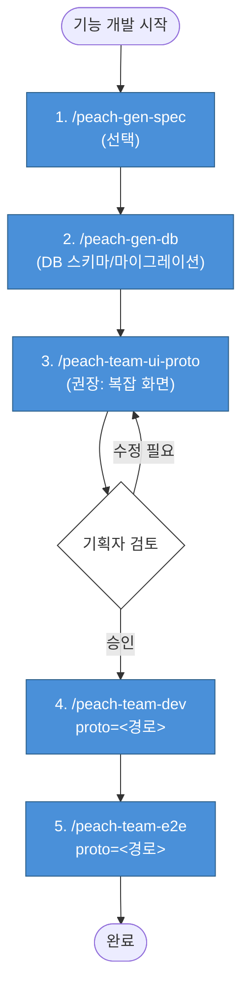
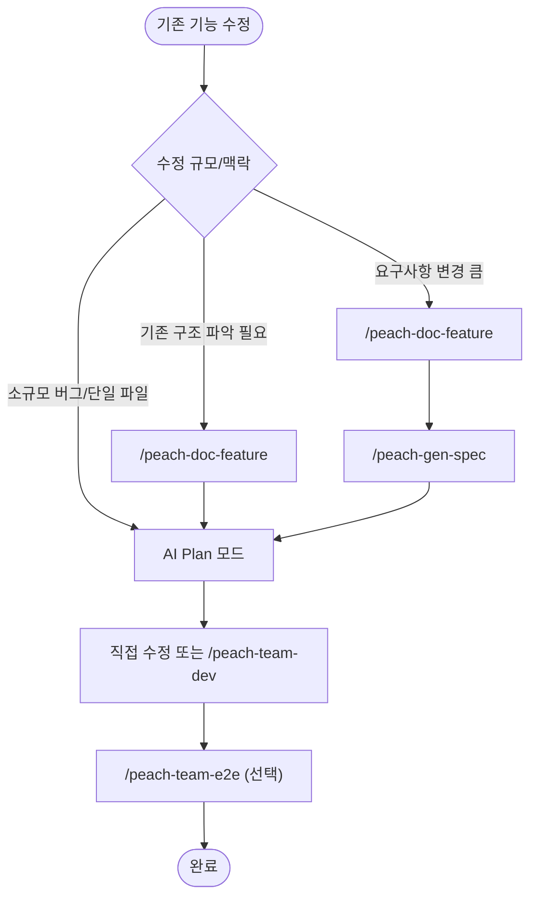

# 사용 플로우

> 2026-04-27 갱신: ui-proto 연계 + 통합 스킬 도입 (`peach-team-dev`, `peach-team-e2e`)
> 최신 실행 기준: 이 문서
> 과거 의사결정 배경: `docs/분석/2026-04-27-스킬재구성-분석.md`

개발자가 작업 유형에 따라 어떤 스킬을 어떤 순서로 사용하는지 안내한다.

---

## 0. 기준 역할

대규모 신규 개발에서는 PRD부터 시작할 수 있다. 단, PRD는 바로 구현 기준이 아니라 원천 자료다.

| 자료 | 역할 |
|------|------|
| PRD | 원천 자료. 업무 흐름, 정책, 화면 요구, 예외를 넓게 담는다 |
| Spec | 구현 기준. PRD를 AI가 개발 가능한 TEST_ID/권한/상태/오류/화면 흐름으로 정제한 문서 |
| DB/ERD 후보 | PRD-first 초기 구조 초안. 확정 전에는 구현 기준이 아니다 |
| schema/migration | 확정 구조 기준. `peach-team-dev`가 API/Store를 만들 때 참조한다 |
| UI Proto | 화면 해석 검증 장치. 복잡 화면에서 기획 해석을 눈으로 확인한다 |

PRD와 Spec이 충돌하면 구현 단계에서는 Spec을 우선한다. PRD에는 있는데 Spec에 없는 요구는 바로 구현하지 않고 `PRD_TO_SPEC_REQUIRED`로 분리한다.

---

## 1. 표준 플로우 (권장형 5단계)



핵심 원칙:

- **검증 기준의 외부화**: ui-proto + Spec이 본 개발의 검증 기준
- **Spec Source of Truth**: ui-proto 저장소의 `_spec.md`가 원본, 본 프로젝트는 사본
- **DB 선행**: `peach-team-dev`는 DB를 생성하지 않고, 준비된 `api/db/schema/...`를 기준으로 API/Store/UI를 만든다
- **Spec 자동 복사**: `peach-team-dev` 시작 시 자동 처리 (사람이 의식하지 않음)
- **분할 우선**: 백엔드 먼저 → ui-proto 완성 → UI 이어서 (권장)

ui-proto는 필수 단계가 아니라 **품질 증폭 장치**다. 백엔드 중심 작업, 기존 화면의 작은 수정, 단순 CRUD는 Spec-only로 진행할 수 있다. 신규 화면이 많거나 다단계 흐름, 권한/상태 분기, E2E 고품질 검증이 필요하면 ui-proto를 권장한다.

---

## 2. 사용 패턴

### 패턴 A: 표준 (Spec 먼저)

```
/peach-gen-spec → /peach-gen-db → /peach-team-ui-proto → /peach-team-dev → /peach-team-e2e
```

기획서/PRD가 있는 일반 신규 기능.

### 패턴 A-0: PRD-first 신규 개발

```text
PRD 전체 분석
→ /peach-gen-db (DB/ERD 후보 1차 초안)
→ /peach-gen-spec (PRD + DB 초안을 구현 기준으로 정제)
→ /peach-gen-db (확정 schema/migration 생성)
→ /peach-team-ui-proto (복잡 화면이면 권장)
→ /peach-team-dev mode=backend (권장 선행)
→ /peach-team-dev mode=ui 또는 mode=fullstack
→ /peach-team-e2e
→ 개선보완 반복
```

권장 기준:

- PRD가 크고 신규 테이블/상태값/이력 구조가 많으면 DB/ERD 초안을 먼저 잡는다.
- PRD 기반 DB는 확정이 아니라 1차 구조 초안이다. 모호한 테이블/컬럼/상태값은 `DB_DECISION_REQUIRED`로 남긴다.
- Spec은 PRD와 DB 초안을 정제해 실제 구현 기준으로 만든다.
- PRD-only 상태에서는 실제 migration 생성을 강행하지 않는다. 결정 보류가 없고 사용자/Spec 기준이 확정된 뒤 schema/migration을 생성한다.
- Backend API를 먼저 안정화하면 UI/E2E 실패 원인 분리가 쉬워진다.

### 패턴 B: 기획자 직접 (Spec 없이 ui-proto부터)

```
/peach-team-ui-proto (단독 모드) → (필요시 사후) /peach-gen-spec → /peach-gen-db → 본 프로젝트 진행
```

기획자가 화면을 먼저 만들면서 요구사항을 다듬는 경우.

### 패턴 C: 분할 (백엔드 먼저, 권장)

```
/peach-gen-spec → /peach-gen-db → /peach-team-dev mode=backend
                              ↓
/peach-team-ui-proto (병렬 진행 가능)
                              ↓
/peach-team-dev mode=ui proto=<경로> → /peach-team-e2e
```

권장 이유:
- 백엔드 TDD 안정 후 UI가 실 API 붙여 검증 → 백엔드 버그 노이즈 제거
- 세션 분할로 컨텍스트 가벼워짐
- 실제 개발 흐름(백엔드와 ui-proto 병렬)에 부합

### 패턴 C-2: Spec-only 개발

```
/peach-gen-spec → /peach-gen-db → /peach-team-dev mode=backend|ui|fullstack → /peach-team-e2e
```

적합 케이스:
- 백엔드 중심 기능
- 기존 화면에 API/Store만 연결
- 단순 CRUD 또는 화면 흐름이 Spec에 충분히 적힌 작업

주의:
- 화면 레이아웃/세부 인터랙션 검증 신뢰도는 표준 모드보다 낮다
- Spec에 `화면 흐름 요약`이 없으면 E2E는 일반 패턴으로 추정한다
- 신규 복잡 화면은 ui-proto 작성 후 진행하는 편이 1차 완성도가 높다

### 패턴 D: 작은 단일 기능

```
/peach-team-3a
```

소규모 단일 기능, 빠른 설계-구현-검토 루프가 필요할 때.

### 패턴 F: 즉흥적 작업 (Spec/proto 없이, prompt 모드)

```
/peach-team-dev "버그/개선 사항을 자연어로 입력"
```

team-dev가 입력 규모를 분석해 자동 분기:
- 소규모: 단독 모드 즉시 실행
- 중규모: 팀 모드 + (선택) Spec 자동 생성 제안
- 대규모: Spec 작성 권고 (사용자 확정 또는 `force=Y`로 진행)

적합 케이스: 작은 버그 수정, 즉흥적 기능 추가, 성능 개선, 긴급 핫픽스.

주의:
- 검증 기준이 prompt 텍스트뿐이므로 결과를 직접 확인해야 한다
- 매우 작은 수정은 AI Plan 모드 + Edit이 더 빠를 수 있다

### 패턴 E: 기존 기능 수정



- 소규모: AI Plan 모드 + Edit 직접 수정
- 중규모: `peach-doc-feature`로 As-Is 파악 후 진행
- 요구사항 변경: `peach-doc-feature` + `peach-gen-spec`으로 변경 Spec 확정 후 진행

---

## 2-1. 개선보완 반복 플로우

1차 개발 이후에는 완성본 검토, E2E, 사용자 피드백을 다음 분류로 나눈 뒤 필요한 스킬만 재실행한다.

| 분류 | 의미 | 후속 처리 |
|------|------|-----------|
| `PRD_TO_SPEC_REQUIRED` | PRD에는 있으나 Spec에 없는 요구 | Spec 보강 후 관련 기능 재개 |
| `DB_DECISION_REQUIRED` | PRD/Spec만으로 DB 판단이 모호 | 사용자 결정 후 `peach-gen-db` 재실행 |
| `DB_CHANGE_REQUIRED` | 개발 중 schema 변경 필요 | `peach-gen-db` 또는 `peach-db-migrate` 후 blocked 기능 재개 |
| `IMPLEMENT_CHANGE` | 구현 버그/누락 | `peach-team-dev` 재실행 |
| `UI_PROTO_CHANGE` | 화면 해석/기획 검토 보완 필요 | `peach-team-ui-proto` 보강 후 dev/e2e 재검증 |
| `E2E_SCENARIO_FIX` | 시나리오 셀렉터/타이밍 오류 | `peach-e2e-scenario` 자동수정 |
| `DECISION_REQUIRED` | 권한/정책/상태 전이 기준 모호 | 사용자 결정 후 Spec 또는 DB 기준 보강 |

Ralph Loop는 구현 또는 시나리오 오류에만 사용한다. PRD/Spec/DB 기준이 모호한 항목은 반복 수정하지 않고 즉시 `blocked` 또는 `*_REQUIRED`로 분리한다.

---

## 3. 신규 기능 — 단계별 산출물

| 순서 | 스킬 | 산출물 → 다음 입력 |
|------|------|------------------|
| 0 | PRD | 원천 자료. 바로 구현하지 않고 Spec/schema로 정제 |
| 1 | `peach-gen-spec` | Spec 문서 → ui-proto 화면 작성 입력 |
| 2 | `peach-gen-db` | 마이그레이션 + `api/db/schema/...` → 본 개발의 DB 기준. PRD-first에서는 먼저 DB/ERD 후보를 만들고, 확정 후 schema/migration을 생성 |
| 3 | `peach-team-ui-proto` | ui-proto 태스크 폴더 (`_spec.md` + Vue 화면) → 본 개발 검증 기준. 선택 단계지만 복잡 화면에서는 권장 |
| 4 | `peach-team-dev` | 본 프로젝트 코드 + `docs/spec/` 사본 → E2E 검증 기준 |
| 5 | `peach-team-e2e` | E2E 시나리오 + 부합 검증 결과 → 릴리스. 실행 중 오류 발견 시 AI가 자율 보완 루프 수행 (시나리오 .js 수정, suite md 보정). 본 프로젝트 코드 미스매치는 `peach-team-dev`로 위임 |

순서를 어기면:
- **proto 없이 dev** → 가능하지만 화면/시각 검증 신뢰도는 낮아짐. Spec의 화면 흐름 요약이 중요
- **DB 없이 dev** → API/Store 생성 기준 부재
- **dev 없이 e2e** → 검증 대상 부재
- **Spec 없이 dev** → 비즈니스 규칙/예외 검증 불가

---

## 4. 검증 우선순위 규칙

ui-proto는 본질적으로 Mock이라 100% 구현되지 않을 수 있다. 다음 우선순위를 적용한다.

| 검증 항목 | 1차 기준 | 2차 기준 |
|----------|---------|---------|
| 화면 레이아웃, 컴포넌트 배치 | ui-proto 화면 | (없으면 Spec) |
| 사용자 인터랙션 흐름 | ui-proto 화면 | Spec |
| 비즈니스 규칙 (검증, 권한, 분기) | Spec | (없으면 검증 불가 → 보고) |
| 데이터 정확성 | Spec | (없으면 검증 불가 → 보고) |
| 에러/예외 처리 | Spec | - |

**핵심 원칙**: ui-proto가 있으면 ui-proto, 없거나 모호하면 Spec, 둘 다 모호하면 보고.

과거 배경: `docs/분석/2026-04-27-스킬재구성-분석.md` §2-2. 최신 실행 기준은 이 문서와 각 스킬 문서를 따른다.

---

## 5. 빠른 참조표 (3-Tier)

### Tier 1: 표준 플로우 (대부분 이걸로 시작)

| 상황 | 스킬 |
|------|------|
| 대규모 신규 개발 — PRD-first | `/peach-gen-db` → `/peach-gen-spec` |
| 신규 기능 — Spec 작성 | `/peach-gen-spec` |
| 신규 기능 — DB 스키마/마이그레이션 | `/peach-gen-db` |
| 신규 기능 — ui-proto 작성 | `/peach-team-ui-proto` |
| 본 개발 (풀스택/백엔드/UI) | `/peach-team-dev mode=...` |
| 즉흥적 작업 (Spec/proto 없이) | `/peach-team-dev "자연어 설명"` |
| E2E 검증 | `/peach-team-e2e` |
| 작은 단일 기능 | `/peach-team-3a` |
| 기존 기능 As-Is 분석 | `/peach-doc-feature` |

### Tier 2: 단계별 호출 (전문가용)

| 단계 | 스킬 |
|------|------|
| DB 보조 작업 | `/peach-db-migrate`, `/peach-db-extract-schema`, `/peach-erd` |
| 백엔드만 | `/peach-gen-backend` |
| Store만 | `/peach-gen-store` |
| UI만 | `/peach-gen-ui` |
| E2E 단계별 | `/peach-e2e-setup`, `/peach-e2e-scenario`, `/peach-e2e-suite`, `/peach-e2e-browse` |

### Tier 3: 보조/특수

| 상황 | 스킬 |
|------|------|
| 외부 API 연동 | `/peach-add-api` |
| Cron 작업 | `/peach-add-cron` |
| 인쇄 페이지 | `/peach-add-print` |
| 디자인 컨설팅 | `/peach-gen-design` (각 ui-proto 프로젝트 내부 디자인 시스템 우선) |
| 선택적 UX 리뷰 | `/peach-review-ux` |
| 다이어그램 | `/peach-gen-diagram` |
| 문서 변환 | `/peach-markitdown` |
| 위키 | `/peach-wiki` |
| 분석 팀 | `/peach-team-analyze` |
| DB 조회 | `/peach-db-query` |
| 하네스 설정 | `/peach-setup-harness`, `/peach-setup-ui-proto`, `/peach-setup-project` |
| 도움말 | `/peach-help` |
| 스킬 피드백 | `/peach-skill-feedback` |

### 지양

| 항목 | 권고 |
|------|------|
| 리팩토링 | **AI Plan 모드 + Edit 우선.** 별도 리팩토링 스킬은 폐기됨 (2026-04-27) |

---

## 6. 신규 통합 스킬 사용법

### `peach-team-dev`

3가지 입력 모드를 지원한다.

```bash
# 표준 모드 (Spec + DB 스키마 + ui-proto 기반)
/peach-team-dev mode=backend|ui|fullstack proto=<경로> [model=...]

# Spec만 모드 (proto 생략, docs/spec/...에 Spec 존재)
/peach-team-dev mode=backend|ui|fullstack [model=...]

# 대규모 작업 기능 큐 모드
/peach-team-dev [작업명] queue=<기능큐.md> [proto=<경로>] [model=...]

# prompt 모드 (Spec/proto 없이 자연어 입력)
/peach-team-dev "버그/개선 사항 자연어 설명" [force=Y] [model=...]
```

| 인자 | 역할 |
|------|------|
| `mode` | 표준/Spec만 모드에서 필수 |
| `proto` | 선택. ui-proto 저장소의 태스크 폴더 절대 경로 |
| `queue` | 선택. 대규모 작업을 기능별 상태와 입력 기준으로 나눈 큐 문서 |
| `prompt` | 위치 인자. 자연어 작업 설명 |
| `force` | 선택. 큰 변경에도 Spec 권고 무시하고 강제 진행 |
| `model` | 선택. 서브에이전트 모델 override |

`proto` 인자 동작:
1. 폴더 존재, `_spec.md` 존재 검증
2. `_spec.md`를 본 프로젝트의 `docs/spec/{년}/{월}/{개발자}-{YYMMDD}-{기능명}.md`로 자동 복사
3. `mode=backend|fullstack`이면 `api/db/schema/...` 존재 확인
4. 충돌 시 사용자 확인
5. ui-proto 화면 폴더를 구현 참고/검증 기준 컨텍스트로 주입

prompt 모드 동작:
1. 입력 분석 → 작업 규모/영향 범위 추정
2. 분기: 소규모(단독 즉시) / 중규모(팀 + Spec 제안) / 대규모(Spec 권고 또는 `force=Y`)
3. prompt를 임시 컨텍스트로 주입 후 실행. 랄프루프 5회

Spec-only 모드 한계:
1. Spec의 `화면 흐름 요약`을 UI 흐름의 최소 기준으로 사용
2. UI Proto가 없으면 화면 레이아웃/세부 인터랙션 검증은 약하게 판정
3. 개발 중 컬럼/인덱스/상태값 부족 발견 시 `DB_CHANGE_REQUIRED`로 blocked 처리 후 `peach-gen-db` 또는 `peach-db-migrate`로 넘김
4. 완료 보고에는 TEST_ID 매핑, Contract Gate, Spec-only 검증 한계를 남김

예:
```bash
# 풀스택 일괄
/peach-team-dev mode=fullstack proto=/Users/.../260427-nettem-goods

# 백엔드 먼저
/peach-gen-db
/peach-team-dev mode=backend

# UI 이어서
/peach-team-dev mode=ui proto=/Users/.../260427-nettem-goods

# 즉흥적 버그 수정
/peach-team-dev "list.vue에서 검색 후 페이지네이션 클릭 시 검색어 초기화되는 문제 수정"

# 큰 변경 강제 진행
/peach-team-dev "주문 모듈에 환불 기능 전체 추가" force=Y
```

### `peach-team-e2e`

```bash
/peach-team-e2e [proto=<경로>] [model=opus|sonnet|haiku]
```

동작:
1. `proto`의 `_spec.md` + 화면 폴더, 본 프로젝트 `docs/spec/...` 모두 로드
2. 검증 기준 일치 여부 확인 (불일치 시 사용자 확인)
3. 시나리오 자동 분할 + 통합 suite 작성
4. 실행 + 미스매치 분류 (Spec/proto/시나리오)
5. 보완 루프 (5/10회)

---

## 7. 산출물 저장 구조

```
docs/
├── spec/                       # peach-gen-spec 산출물 (또는 ui-proto에서 복사)
│   └── {년}/
│       └── {월}/
│           └── [개발자]-[YYMMDD]-[한글기능명].md
├── qa/                         # 팀 스킬 검증 보고서
│   └── {년}/
│       └── {월}/
│           └── [개발자]-[YYMMDD]-[한글기능명].md
└── e2e-suite/                  # peach-team-e2e 통합 시나리오
    └── {업무흐름}-{핵심동작}.md
```

ui-proto 저장소(별도):
```
ui-proto-{도메인}/
└── src/modules-task/
    └── {년월}/
        └── {년월일-이니셜-태스크명}/
            ├── _task-meta.ts
            ├── _spec.md         # Spec 원본 (Source of Truth)
            ├── overview/        # 기획서 화면
            └── {서브모듈}/      # UI 화면
```

---

## 8. 변경 이력

| 날짜 | 변경 |
|------|------|
| 2026-05-02 | 신규 기능 표준 플로우에 `peach-gen-db`를 명시. `peach-team-dev`는 DB 생성이 아니라 준비된 DB 스키마 기반 개발을 담당 |
| 2026-05-03 | PRD-first 신규 개발과 1차 개발 이후 개선보완 반복 분류를 추가 |
| 2026-05-02 | ui-proto를 필수 단계가 아닌 품질 증폭 장치로 정리하고, Spec-only/queue/DB_CHANGE_REQUIRED 흐름을 추가 |
| 2026-05-02 | 선택적 UX 리뷰 스킬 `peach-review-ux` 추가. 기존 QA 게이트에는 아직 통합하지 않고 독립 리뷰 스킬로 운영 |
| 2026-04-27 | ui-proto 연계, `peach-team-dev`/`peach-team-e2e` 도입, 리팩토링 스킬 폐기 |
