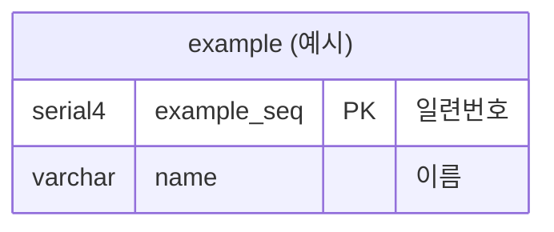

# ERD 원스톱 스킬

## 파일 경로

| 파일 | 용도 |
|------|------|
| `docs/erd/erd.mmd` | Mermaid ERD 소스 |
| `docs/erd/erd.png` | PNG 렌더링 (git 커밋용) |
| `docs/erd/erd.svg` | SVG 렌더링 (git 커밋용) |

---

## 워크플로우

### 1단계: 환경 확인

mermaid MCP 서버가 등록되어 있는지 확인한다.

```bash
claude mcp list 2>/dev/null | grep mermaid
```

**미등록 시 자동 설치:**
```bash
npm install -g claude-mermaid
claude mcp add --scope user mermaid claude-mermaid
```

설치 후 사용자에게 "claude-mermaid MCP를 설치했습니다. Claude Code를 재시작해야 MCP가 활성화됩니다." 안내한다.

### 2단계: erd.mmd 확인

`docs/erd/erd.mmd` 파일이 존재하는지 확인한다.

**파일 없으면** → 폴더 생성 + 기본 템플릿으로 erd.mmd 생성:



**파일 있으면** → 읽어서 현재 내용 파악.

### 3단계: 수정

사용자가 수정을 요청하면 erd.mmd를 수정한다. 수정 없이 미리보기/저장만 요청한 경우 이 단계를 건너뛴다.

### 4단계: 실행

**먼저 erd.mmd 수정 여부를 판단한다.**

```bash
git diff --name-only | grep "erd.mmd"
```

- 출력 있음 → **수정됨**
- 출력 없음 → **미변경**

#### erd.mmd가 수정된 경우 — 미리보기 + 파일 저장 병렬 실행

**작업 A — 브라우저 미리보기** (mermaid MCP):
```
mcp__mermaid__mermaid_preview:
  preview_id: "erd-main"
  diagram: {erd.mmd 전체 내용}
  width: 1400
  height: 1200
  scale: 2
```

**작업 B — PNG/SVG 파일 저장** (Bash, 프로젝트 루트에서):
```bash
npx @mermaid-js/mermaid-cli@latest \
  -i docs/erd/erd.mmd \
  -o docs/erd/erd.png \
  -s 2 && \
npx @mermaid-js/mermaid-cli@latest \
  -i docs/erd/erd.mmd \
  -o docs/erd/erd.svg
```

**작업 A 실패 시** (MCP 미연결):
- 작업 B(CLI)만 실행하여 PNG/SVG 저장은 보장한다.
- 사용자에게 안내: "브라우저 미리보기를 사용하려면 Claude Code를 재시작하거나 `claude mcp add --scope user mermaid claude-mermaid`로 MCP를 등록하세요."

#### erd.mmd가 수정되지 않은 경우 — 미리보기만 실행

PNG/SVG 재생성 불필요. 작업 A만 실행한다.

```
mcp__mermaid__mermaid_preview:
  preview_id: "erd-main"
  diagram: {erd.mmd 전체 내용}
  width: 1400
  height: 1200
  scale: 2
```

### 5단계: 결과 보고

- 브라우저 미리보기 URL (성공 시)
- 저장된 PNG/SVG 파일 경로
- 수정 반복이 필요하면 3단계로 돌아간다

### 6단계: Git 후속 처리

미리보기 완료 후 git 상태를 확인하고 자동으로 판단한다.

```bash
git diff --name-only
```

**판단 기준:**

| 상황 | 판단 | 처리 |
|------|------|------|
| `erd.mmd`가 변경됨 | PNG/SVG도 커밋 대상 | 3개 파일 모두 스테이징 → 커밋 |
| `erd.mmd` 미변경 (preview만) | PNG/SVG 변경 무시 | 커밋 불필요 |

**자동 처리 절차:**

1. `git diff --name-only`로 변경 파일 목록 확인
2. `erd.mmd` 포함 여부 판단
3. 사용자에게 브리핑:

```
📊 ERD Git 처리 브리핑

변경된 파일:
  - docs/erd/erd.mmd  ← 수정됨  (또는 미변경)
  - docs/erd/erd.png  ← 재렌더링
  - docs/erd/erd.svg  ← 재렌더링

판단: [erd.mmd 수정됨 → 3개 파일 커밋 권장] 또는 [erd.mmd 미변경 → 커밋 불필요]

커밋 메시지 (안): "docs: ERD 업데이트 - {변경 내용 한 줄 요약}"

진행하시겠습니까?
  A) 커밋 진행
  B) 스테이징만 (커밋 보류)
  C) 처리 안 함
```

4. 사용자 선택에 따라 처리:
   - **A 선택**: `git add docs/erd/erd.mmd docs/erd/erd.png docs/erd/erd.svg && git commit -m "..."`
   - **B 선택**: `git add docs/erd/erd.mmd docs/erd/erd.png docs/erd/erd.svg`
   - **C 선택**: 처리 없이 종료

---

## ERD 작성 규칙

### 엔티티명

`["영문명 (한글명)"]` 형식으로 작성한다. 관계선에서는 엔티티명만 사용한다 (병기하면 렌더링 오류).

```
employee["employee (직원)"] { ... }            ✅
employee ||--o{ employee_hist : "이력"         ✅
employee["employee (직원)"] ||--o{ ...         ❌ 렌더링 오류
```

### 인덱스 마커

컬럼 코멘트 끝에 대괄호로 표기한다.

| 마커 | 의미 | 예시 |
|------|------|------|
| `[IDX]` | 일반 인덱스 | `int4 branch_seq FK "branch 참조 [IDX]"` |
| `[PIDX]` | Partial Index (WHERE is_delete='N') | `varchar status "상태 코드 [PIDX]"` |
| `[UIDX]` | Unique Index | `varchar cert_no "증명서 번호 [UIDX]"` |
| `[PIDX:a+b]` | 복합 Partial Index | `varchar status "... [PIDX:status+region_seq]"` |

### 감사 필드

- 마스터 테이블: `is_delete`, `insert_seq`, `insert_date`, `update_seq`, `update_date`
- 이력 테이블: `insert_seq`, `insert_date` (만)
