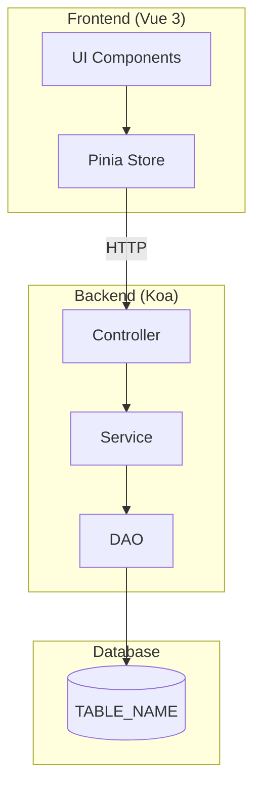

# FEATURE_NAME_KR

> DESCRIPTION

---

# Part A: Visual Overview (사람용)

이 섹션은 시각적 이해를 위한 다이어그램입니다. Mermaid 코드도 텍스트로 읽어 구조 파악에 활용됩니다.

---

## 시스템 아키텍처



---

## 데이터 흐름

DATA_FLOW_DIAGRAM

---

## UI 흐름도

UI_FLOW_DIAGRAM

---

## ER 다이어그램

```mermaid
erDiagram
    TABLE_NAME {
        PK_TYPE TABLE_NAME_seq PK
SCHEMA_ER_COLUMNS
        CHAR is_use
        CHAR is_delete
        FK_TYPE insert_seq
        DATETIME_TYPE insert_date
        FK_TYPE update_seq
        DATETIME_TYPE update_date
    }
ER_RELATIONS
```

---

# Part B: Detailed Spec (AI용)

이 섹션은 AI 코드 생성을 위한 상세 명세입니다.

---

## 메타
- 모듈명: MODULE_NAME
- 테이블명: TABLE_NAME
- 한글 기능명: FEATURE_NAME_KR
- 한줄 설명: DESCRIPTION
- UI 패턴: UI_PATTERN
- 파일 업로드: FILE_UPLOAD_YN
- 저장 방식: STORAGE_TYPE
- PRD 원천: SOURCE_PRD
- 설계 메모: DESIGN_MEMO

---

## 1. 기능 범위

### CRUD 기능
| 기능 | 적용 | 메서드명 | 설명 |
|------|------|----------|------|
| 페이징 목록 | CRUD_PAGING | findPaging | 페이지네이션 포함 목록 조회 |
| 키워드 검색 | CRUD_LIST | findList | Selectbox용 전체 목록 |
| 상세 조회 | CRUD_DETAIL | detailOne / findOne | 단건 상세 정보 |
| 등록 | CRUD_INSERT | insert | 신규 데이터 생성 |
| 수정 | CRUD_UPDATE | update | 기존 데이터 수정 |
| 사용여부 변경 | CRUD_UPDATE_USE | updateUse | is_use 플래그 토글 |
| 논리 삭제 | CRUD_SOFT_DELETE | softDelete | is_delete='Y' 처리 |

### 파일 기능
| 기능 | 적용 |
|------|------|
| 일반 파일 | FILE_GENERAL_YN |
| 이미지 | FILE_IMAGE_YN |
| 저장 방식 | STORAGE_TYPE |

### PRD 반영 추적

| PRD 요구 | 관련 TEST_ID | Spec 반영 위치 | 비고 |
|----------|--------------|----------------|------|
PRD_TO_SPEC_TRACE

### PRD_TO_SPEC_REQUIRED

PRD에는 있으나 구현 기준으로 정제되지 않은 항목이다. 이 항목은 바로 구현하지 않고 Spec 보강 후 진행한다.

| PRD 항목 | 필요한 결정/정제 | 영향 범위 | 후속 처리 |
|----------|------------------|-----------|-----------|
PRD_TO_SPEC_REQUIRED

---

## 2. 1차 완성도 기준

이 섹션은 `peach-team-dev`와 `peach-team-e2e`가 처음 실행에서 누락을 줄이기 위한 검증 기준이다.

### TEST_ID 매트릭스

| TEST_ID | 요구사항 | 구현 레이어 | 검증 방식 | 완료 기준 |
|---------|----------|-------------|-----------|-----------|
FIRST_PASS_TEST_MATRIX

### 권한 경계

| TEST_ID | 역할/권한 그룹 | 데이터 접근 범위 | 필수 조건 | 차단 조건 | 검증 방식 |
|---------|----------------|------------------|-----------|-----------|-----------|
PERMISSION_MATRIX

### 상태 전이

| TEST_ID | 현재 상태 | 액션 | 다음 상태 | 허용 조건 | 금지 조건 | 검증 방식 |
|---------|-----------|------|-----------|-----------|-----------|-----------|
STATE_TRANSITIONS

### 오류 케이스

| TEST_ID | 상황 | 입력/조건 | 기대 메시지 | 처리 방식 | 검증 방식 |
|---------|------|-----------|-------------|-----------|-----------|
ERROR_CASES

### 외부 의존성

| TEST_ID | 의존성 | 성공 응답 | 실패 응답 | 대체/재시도 정책 | 검증 방식 |
|---------|--------|-----------|-----------|------------------|-----------|
EXTERNAL_DEPENDENCIES

### TEST_ID별 검증 매핑

| TEST_ID | Backend TDD | Store/Contract | UI 구현 | E2E | 검증 불가 사유 |
|---------|-------------|----------------|---------|-----|----------------|
TEST_COVERAGE_MAPPING

---

## 3. UI/화면 흐름 기준

### 패턴: UI_PATTERN_FULL_NAME

UI Proto가 없는 경우 `peach-team-dev`와 `peach-team-e2e`는 이 섹션을 화면 흐름의 1차 기준으로 사용한다. UI Proto가 있으면 화면 흐름은 ui-proto를 우선하고, 비즈니스 규칙은 이 Spec을 우선한다.

### 검색 조건
SEARCH_CONDITIONS

### 목록 컬럼
LIST_COLUMNS

### 화면별 필드 구분
FIELD_MAPPING

### 화면 구성
UI_SCREEN_COMPOSITION

### 화면 흐름 요약

| 화면/상태 | 주요 액션 | 성공 결과 | 오류 결과 | 관련 TEST_ID |
|-----------|-----------|-----------|-----------|--------------|
SCREEN_FLOW_SUMMARY

### 검증
UI_VALIDATION_RULES

### 테스트 시나리오
TEST_SCENARIOS

---

## 4. DB 스키마

### DB 종류: DB_TYPE

### 테이블: TABLE_NAME

<!-- PostgreSQL 타입 사용 시 -->
<!-- | TABLE_NAME_seq | serial4 | Y | PK | - | 자동증가 | -->
<!-- | insert_seq | int4 | Y | 등록자 | - | - | -->
<!-- | insert_date | TIMESTAMP | Y | 등록일 | - | - | -->

<!-- MySQL 타입 사용 시 -->
<!-- | TABLE_NAME_seq | BIGINT | Y | PK | - | AUTO_INCREMENT | -->
<!-- | insert_seq | BIGINT | Y | 등록자 | - | - | -->
<!-- | insert_date | DATETIME | Y | 등록일 | - | - | -->

| 컬럼 | 타입 | 필수 | 설명 | 선택값 | 기본값 |
|------|------|------|------|--------|--------|
| TABLE_NAME_seq | PK_TYPE | Y | PK | - | PK_DEFAULT |
SCHEMA_COLUMNS
| is_use | CHAR(1) | Y | 사용여부 | Y:사용,N:미사용 | Y |
| is_delete | CHAR(1) | Y | 삭제여부 | Y:삭제,N:정상 | N |
| insert_seq | FK_TYPE | Y | 등록자 | - | - |
| insert_date | DATETIME_TYPE | Y | 등록일 | - | - |
| update_seq | FK_TYPE | Y | 수정자 | - | - |
| update_date | DATETIME_TYPE | Y | 수정일 | - | - |

### 인덱스
```sql
SCHEMA_INDEXES
```

### 참조 관계 (FK 생성 안함)
REFERENCE_RELATIONS

### 개발 중 DB 변경 후보

개발 중 컬럼/인덱스/상태값 부족이 발견되면 `peach-team-dev`가 직접 DB를 수정하지 않고 `DB_CHANGE_REQUIRED`로 보고한 뒤 `peach-gen-db` 또는 `peach-db-migrate` 단계로 넘긴다.

| 후보 | 변경 유형 | 필요한 이유 | 관련 TEST_ID | 확정 조건 |
|------|-----------|-------------|--------------|-----------|
DB_CHANGE_CANDIDATES

---

## 5. 파일 목록

### Backend
```
api/src/modules/MODULE_NAME/
├── type/
│   └── MODULE_NAME.type.ts
├── dao/
│   └── MODULE_NAME.dao.ts
├── service/
│   ├── MODULE_NAME.service.ts
│   └── MODULE_NAME-tdd.service.ts
├── controller/
│   ├── MODULE_NAME.validator.ts
│   └── MODULE_NAME.controller.ts
└── test/
    └── MODULE_NAME.test.ts
```

### Frontend
```
front/src/modules/MODULE_NAME/
├── type/
│   └── MODULE_NAME.type.ts
├── store/
│   └── MODULE_NAME.store.ts
├── pages/
│   ├── list.vue
│   ├── list-search.vue
│   └── list-table.vue
├── modals/
FRONTEND_MODAL_FILES
└── test/
    └── MODULE_NAME.test.ts (선택)
```

---

## 6. 참조
- 가이드 코드:
  - Backend: `api/src/modules/test-data/`
  - Frontend: `front/src/modules/test-data/FRONTEND_GUIDE_PATH`
