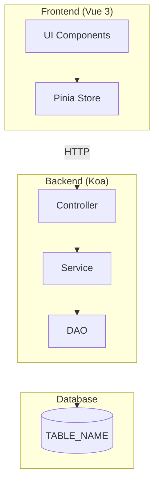

# FEATURE_NAME_KR

> DESCRIPTION

---

# Part A: Visual Overview (사람용)

이 섹션은 시각적 이해를 위한 다이어그램입니다. Mermaid 코드도 텍스트로 읽어 구조 파악에 활용됩니다.

---

## 시스템 아키텍처



---

## 데이터 흐름

DATA_FLOW_DIAGRAM

---

## UI 흐름도

UI_FLOW_DIAGRAM

---

## ER 다이어그램

```mermaid
erDiagram
    TABLE_NAME {
        PK_TYPE TABLE_NAME_seq PK
SCHEMA_ER_COLUMNS
        CHAR is_use
        CHAR is_delete
        FK_TYPE insert_seq
        DATETIME_TYPE insert_date
        FK_TYPE update_seq
        DATETIME_TYPE update_date
    }
ER_RELATIONS
```

---

# Part B: Detailed Spec (AI용)

이 섹션은 AI 코드 생성을 위한 상세 명세입니다.

---

## 메타
- 모듈명: MODULE_NAME
- 테이블명: TABLE_NAME
- 한글 기능명: FEATURE_NAME_KR
- 한줄 설명: DESCRIPTION
- UI 패턴: UI_PATTERN
- 파일 업로드: FILE_UPLOAD_YN
- 저장 방식: STORAGE_TYPE
- PRD 원천: SOURCE_PRD
- 설계 메모: DESIGN_MEMO

---

## 1. 기능 범위

### CRUD 기능
| 기능 | 적용 | 메서드명 | 설명 |
|------|------|----------|------|
| 페이징 목록 | CRUD_PAGING | findPaging | 페이지네이션 포함 목록 조회 |
| 키워드 검색 | CRUD_LIST | findList | Selectbox용 전체 목록 |
| 상세 조회 | CRUD_DETAIL | detailOne / findOne | 단건 상세 정보 |
| 등록 | CRUD_INSERT | insert | 신규 데이터 생성 |
| 수정 | CRUD_UPDATE | update | 기존 데이터 수정 |
| 사용여부 변경 | CRUD_UPDATE_USE | updateUse | is_use 플래그 토글 |
| 논리 삭제 | CRUD_SOFT_DELETE | softDelete | is_delete='Y' 처리 |

### 파일 기능
| 기능 | 적용 |
|------|------|
| 일반 파일 | FILE_GENERAL_YN |
| 이미지 | FILE_IMAGE_YN |
| 저장 방식 | STORAGE_TYPE |

### PRD 반영 추적

| PRD 요구 | 관련 TEST_ID | Spec 반영 위치 | 비고 |
|----------|--------------|----------------|------|
PRD_TO_SPEC_TRACE

### PRD_TO_SPEC_REQUIRED

PRD에는 있으나 구현 기준으로 정제되지 않은 항목이다. 이 항목은 바로 구현하지 않고 Spec 보강 후 진행한다.

| PRD 항목 | 필요한 결정/정제 | 영향 범위 | 후속 처리 |
|----------|------------------|-----------|-----------|
PRD_TO_SPEC_REQUIRED

---

## 2. TEST_ID 상태 추적

Spec 전체 상태는 TEST_ID별 UI Proto 반영 상태, 구현 상태, 검증 상태를 집계해 판단한다. `S04 구현완료(IMPLEMENTED)`는 코드 구현 완료, `S05 검증완료(VERIFIED)`는 테스트/빌드/E2E/QA 근거 확인을 의미하므로 둘을 분리한다.

### 상태 요약

| 항목 | 값 |
|------|----|
SPEC_STATUS_SUMMARY

### TEST_ID별 상태

| TEST_ID | 요구사항 | UI Proto 상태 | UI 근거 | 구현 상태 | 구현 근거 | 검증 상태 | 검증 근거 | 잔여 이슈 |
|---------|----------|---------------|---------|-----------|-----------|-----------|-----------|-----------|
TEST_ID_STATUS_MATRIX

### 상태값 기준

| 상태 축 | 코드 | 한글 | 키 | 의미 |
|---------|------|------|----|------|
| Spec 상태 | S01 | 초안 | DRAFT | 요구사항 정리 중 |
| Spec 상태 | S02 | 확정 | APPROVED | 구현 기준으로 확정됨 |
| Spec 상태 | S03 | 구현중 | IMPLEMENTING | 하나 이상의 TEST_ID가 구현 중 |
| Spec 상태 | S04 | 구현완료 | IMPLEMENTED | 모든 TEST_ID 코드 구현 완료 |
| Spec 상태 | S05 | 검증완료 | VERIFIED | 모든 TEST_ID 검증 근거 확인 |
| Spec 상태 | S90 | 차단 | BLOCKED | 핵심 TEST_ID 진행 차단 |
| Spec 상태 | S99 | 대체됨 | SUPERSEDED | 다른 Spec으로 대체됨 |
| UI Proto 반영 상태 | U01 | 미반영 | NOT_MAPPED | 화면/액션/상태 매핑 전 |
| UI Proto 반영 상태 | U02 | 일부반영 | PARTIAL | 일부 TEST_ID만 화면 기준에 반영 |
| UI Proto 반영 상태 | U03 | 반영완료 | MAPPED | TEST_ID가 화면/액션/완료/오류 상태에 반영 |
| UI Proto 반영 상태 | U80 | 검증불가 | UNTESTABLE | Mock 또는 화면 범위 한계로 검증 불가 |
| UI Proto 반영 상태 | U90 | 차단 | BLOCKED | 화면 기준 확정 불가 |
| 구현 상태 | I01 | 구현전 | TODO | 구현 전 |
| 구현 상태 | I02 | 일부구현 | PARTIAL | 일부 구현 |
| 구현 상태 | I03 | 구현완료 | DONE | 코드 구현 완료 |
| 구현 상태 | I90 | 차단 | BLOCKED | 구현 차단 |
| 검증 상태 | V01 | 검증전 | UNVERIFIED | 검증 전 |
| 검증 상태 | V02 | 일부검증 | PARTIAL | 일부 검증 |
| 검증 상태 | V03 | 검증완료 | VERIFIED | 테스트/빌드/E2E/QA 근거 확인 |
| 검증 상태 | V80 | 검증불가 | UNTESTABLE | 환경/데이터/권한 한계로 검증 불가 |
| 검증 상태 | V90 | 차단 | BLOCKED | 검증 차단 |

### 집계 규칙

- 모든 TEST_ID 구현 상태가 `I01 구현전(TODO)`이면 전체 Spec 상태는 `S02 확정(APPROVED)`
- 하나라도 `I02 일부구현(PARTIAL)` 또는 `I03 구현완료(DONE)`이고 미완료 TEST_ID가 남아 있으면 `S03 구현중(IMPLEMENTING)`
- 모든 TEST_ID 구현 상태가 `I03 구현완료(DONE)`이면 `S04 구현완료(IMPLEMENTED)`
- 모든 TEST_ID 검증 상태가 `V03 검증완료(VERIFIED)`이면 `S05 검증완료(VERIFIED)`
- 핵심 TEST_ID 중 하나라도 `U90`, `I90`, `V90`이면 `S90 차단(BLOCKED)`을 우선 보고
- `TEST_ID별 상태` 표를 수정하면 `상태 요약`도 같은 집계 규칙으로 즉시 재계산한다.

---

## 3. 1차 완성도 기준

이 섹션은 `peach-team-dev`와 `peach-team-e2e`가 처음 실행에서 누락을 줄이기 위한 검증 기준이다.

### TEST_ID 매트릭스

| TEST_ID | 요구사항 | 구현 레이어 | 검증 방식 | 완료 기준 |
|---------|----------|-------------|-----------|-----------|
FIRST_PASS_TEST_MATRIX

### 권한 경계

| TEST_ID | 역할/권한 그룹 | 데이터 접근 범위 | 필수 조건 | 차단 조건 | 검증 방식 |
|---------|----------------|------------------|-----------|-----------|-----------|
PERMISSION_MATRIX

### 상태 전이

| TEST_ID | 현재 상태 | 액션 | 다음 상태 | 허용 조건 | 금지 조건 | 검증 방식 |
|---------|-----------|------|-----------|-----------|-----------|-----------|
STATE_TRANSITIONS

### 오류 케이스

| TEST_ID | 상황 | 입력/조건 | 기대 메시지 | 처리 방식 | 검증 방식 |
|---------|------|-----------|-------------|-----------|-----------|
ERROR_CASES

### 외부 의존성

| TEST_ID | 의존성 | 성공 응답 | 실패 응답 | 대체/재시도 정책 | 검증 방식 |
|---------|--------|-----------|-----------|------------------|-----------|
EXTERNAL_DEPENDENCIES

### TEST_ID별 검증 매핑

| TEST_ID | Backend TDD | Store/Contract | UI 구현 | E2E | 검증 불가 사유 |
|---------|-------------|----------------|---------|-----|----------------|
TEST_COVERAGE_MAPPING

---

## 4. UI/화면 흐름 기준

### 패턴: UI_PATTERN_FULL_NAME

UI Proto가 없는 경우 `peach-team-dev`와 `peach-team-e2e`는 이 섹션을 화면 흐름의 1차 기준으로 사용한다. UI Proto가 있으면 화면 흐름은 ui-proto를 우선하고, 비즈니스 규칙은 이 Spec을 우선한다.

### 검색 조건
SEARCH_CONDITIONS

### 목록 컬럼
LIST_COLUMNS

### 화면별 필드 구분
FIELD_MAPPING

### 화면 구성
UI_SCREEN_COMPOSITION

### 화면 흐름 요약

| 화면/상태 | 주요 액션 | 성공 결과 | 오류 결과 | 관련 TEST_ID |
|-----------|-----------|-----------|-----------|--------------|
SCREEN_FLOW_SUMMARY

### 검증
UI_VALIDATION_RULES

### 테스트 시나리오
TEST_SCENARIOS

---

## 5. DB 스키마

### DB 종류: DB_TYPE

### 테이블: TABLE_NAME

<!-- PostgreSQL 타입 사용 시 -->
<!-- | TABLE_NAME_seq | serial4 | Y | PK | - | 자동증가 | -->
<!-- | insert_seq | int4 | Y | 등록자 | - | - | -->
<!-- | insert_date | TIMESTAMP | Y | 등록일 | - | - | -->

<!-- MySQL 타입 사용 시 -->
<!-- | TABLE_NAME_seq | BIGINT | Y | PK | - | AUTO_INCREMENT | -->
<!-- | insert_seq | BIGINT | Y | 등록자 | - | - | -->
<!-- | insert_date | DATETIME | Y | 등록일 | - | - | -->

| 컬럼 | 타입 | 필수 | 설명 | 선택값 | 기본값 |
|------|------|------|------|--------|--------|
| TABLE_NAME_seq | PK_TYPE | Y | PK | - | PK_DEFAULT |
SCHEMA_COLUMNS
| is_use | CHAR(1) | Y | 사용여부 | Y:사용,N:미사용 | Y |
| is_delete | CHAR(1) | Y | 삭제여부 | Y:삭제,N:정상 | N |
| insert_seq | FK_TYPE | Y | 등록자 | - | - |
| insert_date | DATETIME_TYPE | Y | 등록일 | - | - |
| update_seq | FK_TYPE | Y | 수정자 | - | - |
| update_date | DATETIME_TYPE | Y | 수정일 | - | - |

### 인덱스
```sql
SCHEMA_INDEXES
```

### 참조 관계 (FK 생성 안함)
REFERENCE_RELATIONS

### 개발 중 DB 변경 후보

개발 중 컬럼/인덱스/상태값 부족이 발견되면 `peach-team-dev`가 직접 DB를 수정하지 않고 `DB_CHANGE_REQUIRED`로 보고한 뒤 `peach-gen-db` 또는 `peach-db-migrate` 단계로 넘긴다.

| 후보 | 변경 유형 | 필요한 이유 | 관련 TEST_ID | 확정 조건 |
|------|-----------|-------------|--------------|-----------|
DB_CHANGE_CANDIDATES

---

## 6. 파일 목록

### Backend
```
api/src/modules/MODULE_NAME/
├── type/
│   └── MODULE_NAME.type.ts
├── dao/
│   └── MODULE_NAME.dao.ts
├── service/
│   ├── MODULE_NAME.service.ts
│   └── MODULE_NAME-tdd.service.ts
├── controller/
│   ├── MODULE_NAME.validator.ts
│   └── MODULE_NAME.controller.ts
└── test/
    └── MODULE_NAME.test.ts
```

### Frontend
```
front/src/modules/MODULE_NAME/
├── type/
│   └── MODULE_NAME.type.ts
├── store/
│   └── MODULE_NAME.store.ts
├── pages/
│   ├── list.vue
│   ├── list-search.vue
│   └── list-table.vue
├── modals/
FRONTEND_MODAL_FILES
└── test/
    └── MODULE_NAME.test.ts (선택)
```

---

## 7. 참조
- 가이드 코드:
  - Backend: `api/src/modules/test-data/`
  - Frontend: `front/src/modules/test-data/FRONTEND_GUIDE_PATH`
